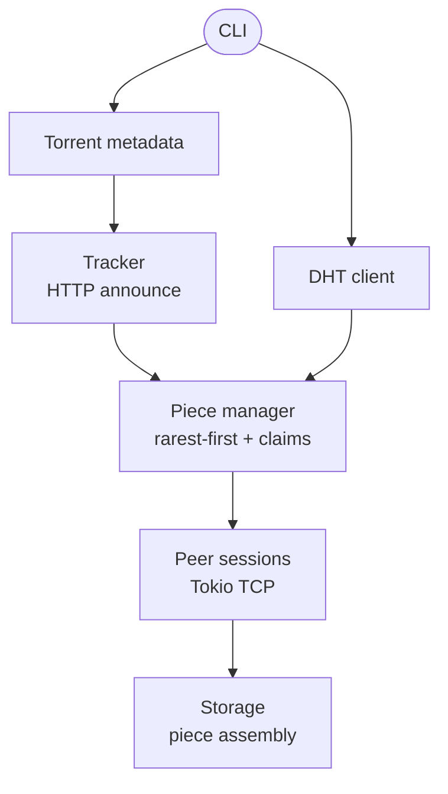

# Ferrite

[](https://www.rust-lang.org)
[](LICENSE)
[](#build--test)
[](#build--test)

**Ferrite** is a from-scratch BitTorrent client in Rust — no libtorrent, no
transmission bindings. It implements the peer wire protocol, tracker
announces, rarest-first piece selection, and DHT peer discovery by hand, as
a systems and distributed-systems portfolio project.

> Educational software. Only use it with content you are legally allowed to
> download and share.

## Demo

Inspect a torrent:

```bash
$ cargo run -- inspect ./example.torrent
Name       : original.bin
Info hash  : 4ed1e15ff4371567085f1f6cd1757c7edd20c970
Size       : 204800 bytes
Piece size : 32768 bytes
Pieces     : 7
Trackers   :
  http://127.0.0.1:18080/announce
```

Download (from the integration test — fake tracker, 3-peer swarm):

```bash
$ ./tests/e2e/run.sh
Tracker returned 3 peers (interval 1800s)
Downloaded 204800 bytes; complete=true

E2E PASS: 204800 bytes, sha256 matches
```

Every piece is SHA-1 verified against the torrent's piece hashes before it
is written; a piece that fails verification is released back for retry
instead of corrupting the output.

## Architecture



**Bencode.** A strict decoder/encoder: rejects duplicate dict keys, invalid
integers (`i03e`, `-0`), and truncated inputs. Dictionaries use ordered
keys, so re-encoding the `info` dict reproduces the exact bytes the
info-hash was computed over.

**Tracker.** HTTP(S) announce with `compact=1` peer decoding (plus
dictionary-model fallback), trying each announce URL in turn. Info-hash and
peer-id are percent-encoded per the spec.

**Peer protocol.** Handshake validation (protocol string + info-hash match),
then a request-driven download loop over Tokio TCP: whenever the peer is
unchoked and holds a piece we need, it is requested immediately — the
client never stalls waiting for inbound chatter. Messages are
length-prefixed with a 2 MiB cap; oversized frames are rejected instead of
being buffered.

**Piece manager.** Tracks per-piece availability from bitfields and `have`
messages, picks the rarest piece first, and hands out per-piece claims so
concurrent peer tasks never download the same piece twice. Completed pieces
are SHA-1 verified.

**DHT.** UDP `get_peers` queries against bootstrap nodes with compact IPv4
peer decoding. Implemented as a client query path (see scope boundaries).

**Storage.** Preallocates output files, then writes verified pieces at the
correct offsets; multi-file torrents are mapped across their file list.

## Project layout

```text
src/main.rs          CLI: inspect / download / dht
src/lib.rs           crate root, client peer-id prefix
src/bencode/         strict bencode codec
src/torrent/         .torrent parsing, info-hash
src/tracker/         HTTP announce, peer list decoding
src/peer/            handshake, wire messages, download loop
src/piece/           rarest-first selection, claims, SHA-1 verification
src/storage/         preallocation, piece assembly, multi-file mapping
src/dht/             UDP DHT get_peers client
tests/e2e/           fake tracker + peer swarm harness (run.sh)
```

## Build & test

```bash
cargo fmt --all -- --check
cargo check --all-targets
cargo test
cargo clippy --all-targets -- -D warnings
cargo build --release
# End-to-end: fake tracker + 3-peer swarm, byte-identical download
./tests/e2e/run.sh
```

Unit tests cover bencode round-trips, torrent parsing, piece framing,
rarest-first selection, and DHT bootstrap handling. The e2e harness builds
a torrent for a random 200 KiB file, serves it from a fake tracker and
three fake peers, downloads it with the release binary, and compares the
output byte-for-byte. No `unsafe` Rust anywhere in the crate.

## Deliberate scope boundaries

This version intentionally does **not** claim support for every BitTorrent
BEP:

- Tracker behavior is HTTP(S) announce only (certificates via rustls).
- No BEP 9 metadata exchange — magnet links are not supported.
- DHT is a client query path: no routing-table maintenance, token
  validation, iterative lookup, or peer announcement yet.
- No upload seeding or tit-for-tat choking; the client is a leecher.
- No message-stream encryption, web seeds, or IPv6.

These boundaries are explicit so the project can be extended without
pretending a partial implementation is complete.

## Roadmap

1. Full iterative Kademlia routing table (k-buckets, XOR distance).
2. BEP 9 metadata exchange for magnet links.
3. Upload seeding with tit-for-tat choking.
4. Persistent resume state and endgame mode.
5. Tracker lifecycle (`started`, periodic, `completed`, `stopped`) and UDP
   trackers.

## Resume bullet

> Built **Ferrite**, a BitTorrent client in Rust implementing bencode
> parsing, tracker-based peer discovery, the peer wire protocol, concurrent
> rarest-first downloads with SHA-1 verification, and UDP DHT peer
> discovery. Verified end-to-end with a fake tracker and peer swarm.

## License

MIT.
